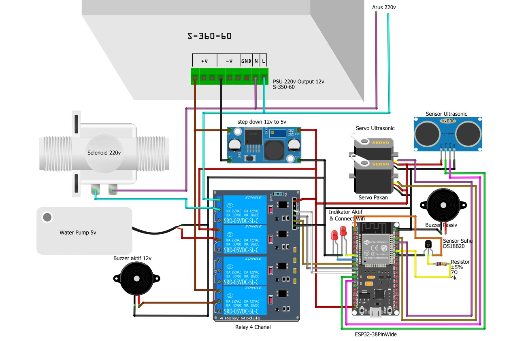

# 🔧 ESP32 Smart Monitoring System

Sistem monitoring dan kontrol otomatis berbasis **ESP32**, terintegrasi dengan **Firebase Firestore** dan **FreeRTOS**. Sistem ini digunakan untuk mendeteksi suhu air, keberadaan hama, serta mengendalikan servo pakan, pompa air, buzzer, dan aktuator lainnya secara otomatis dan real-time.

---

## 🚀 Fitur Utama

- 🔥 **Koneksi Firebase Auth + Firestore** untuk pengiriman dan pembacaan data  
- 🌡️ **Sensor Suhu DS18B20** untuk pemantauan suhu air  
- 📡 **Ultrasonik HC-SR04** untuk deteksi keberadaan hama  
- 🤖 **Servo Pakan & Servo Sensor** yang dapat dikendalikan otomatis  
- 🔊 **Buzzer aktif & buzzer pasif ultrasonic** sebagai respon deteksi hama  
- 💧 **Relay Pompa & Solenoid** untuk kendali suhu air  
- 💡 Indikator LED koneksi dan status sistem  
- 🔄 **FreeRTOS multitasking** untuk menjalankan task-task paralel  
- 🔐 Auto-login & auto-refresh token Firebase setiap 55 menit  

---

## 📦 Library yang Digunakan

```cpp
#include <WiFi.h>
#include <WiFiClientSecure.h>
#include <HTTPClient.h>
#include <ArduinoJson.h>
#include <OneWire.h>
#include <DallasTemperature.h>
#include <ESP32Servo.h>
#include <freertos/FreeRTOS.h>
#include <freertos/task.h>
```

---

## 🌐 Koneksi WiFi & Firebase

- **SSID WiFi**: `gopix`  
- **Email Firebase**: `heppy@gmail.com`  
- **Auth API Key**: (gunakan milik sendiri)  
- Sistem login menggunakan endpoint: `signInWithPassword`

---

## ⚙️ Struktur Task FreeRTOS

| Task               | Fungsi                                                                 |
|--------------------|------------------------------------------------------------------------|
| `taskSuhu`          | Membaca suhu air dan kendali relay pompa/solenoid                      |
| `taskUltrasonic`    | Deteksi objek menggunakan HC-SR04 dan trigger buzzer jika ada hama     |
| `taskBuzzerPasif`   | Menghasilkan suara ultrasonic periodik untuk mengusir hama             |
| `taskServoGerak`    | Menggerakkan servo sensor secara berulang selama tidak ada hama        |
| `taskCekPakan`      | Mengecek status Firebase untuk buka/tutup pakan otomatis               |
| `taskFirebaseSync`  | Sinkronisasi data suhu & hama ke Firestore hanya jika ada perubahan    |
| `taskRefreshToken`  | Refresh token Firebase otomatis setiap 55 menit                        |
| `taskWiFiMonitor`   | Monitor koneksi WiFi dan relogin Firebase jika terputus                |

---

## 📡 Integrasi Firebase

- 🔄 Auto login dan auto refresh token  
- 🔁 Sinkronisasi data suhu dan status hama  
- 📥 Membaca perintah pakan dari koleksi `Action`  
- 📤 Update suhu dan status ke dokumen `Monitoring`  

---

## 🛠️ Hardware yang Digunakan

- ESP32 Dev Board  
- Sensor Suhu DS18B20  
- Sensor Ultrasonik HC-SR04  
- 2x Servo Motor (Pakan dan Sensor)  
- 2x Relay (Pompa & Solenoid)  
- Buzzer Aktif dan Buzzer Pasif  
- LED indikator  
- Breadboard dan kabel jumper  

---

## 🧠 Catatan Teknis

- Token Firebase akan otomatis diperbarui jika expired (HTTP 403)  
- Pembacaan suhu disaring (range valid -50 hingga 100°C)  
- Pembacaan ultrasonic menggunakan median dari 5 pembacaan untuk akurasi  
- Semua task menggunakan mutex agar data tidak bentrok  
- Auto restart ESP32 jika WiFi gagal konek lebih dari 5x  

---

## 🖼️ Skema Sistem



---

## 👨‍💻 Kontributor

**Panji Wira Yudha Buana**  
Email: `panjiwira@example.com`

---

## 📄 Lisensi

Proyek ini bebas digunakan untuk keperluan edukasi dan non-komersial. Untuk penggunaan komersial, harap hubungi pembuat.
